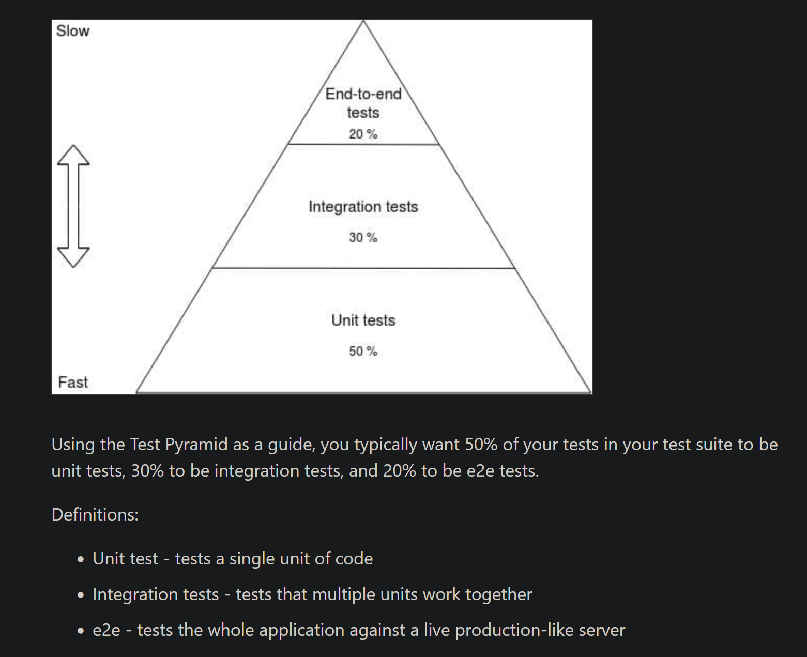

#### fuente: https://testdriven.io/blog/modern-tdd/

#### Pramide para testear



#### Unit tests

Un test unitario es un test que se ejecuta en un entorno aislado, que no depende de otros test, ni de la base de datos,
ni de la red, ni de otros servicios externos.

#### Integration tests

Un test de integración es un test que se ejecuta en un entorno aislado, pero que depende de otros test, de la base de
datos, de la red, de otros servicios externos.

#### End-to-end tests

Un test end-to-end es un test que se ejecuta en la aplicación real

#### Run tests

````
python -m pytest tests
````